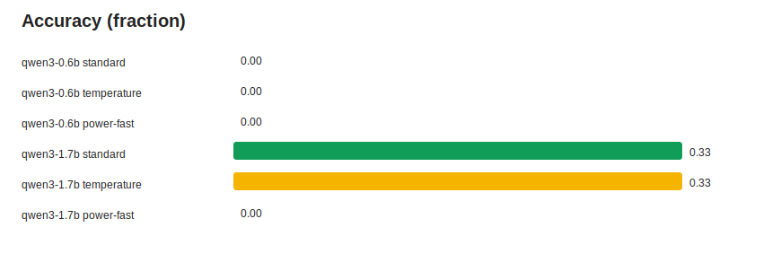
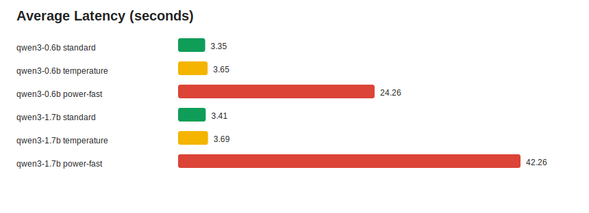
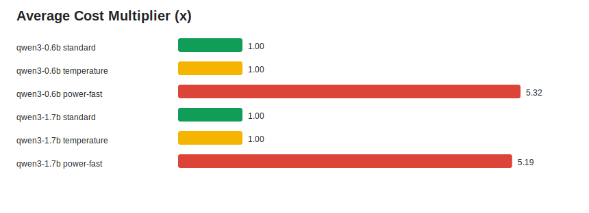

# GSM8K Mini Clean3 Model Compare

This report compares model size and sampler choice on the same three GSM8K examples.

| Label | Sampler | Runs | Accuracy | Avg Latency | Cost x | Acceptance |
| --- | --- | ---: | ---: | ---: | ---: | ---: |
| `qwen3-0.6b` | `standard` | 3 | 0.00 | 3.35s | 1.00 | n/a |
| `qwen3-0.6b` | `temperature` | 3 | 0.00 | 3.65s | 1.00 | n/a |
| `qwen3-0.6b` | `power-fast` | 3 | 0.00 | 24.26s | 5.32 | 0.75 |
| `qwen3-1.7b` | `standard` | 3 | 0.33 | 3.41s | 1.00 | n/a |
| `qwen3-1.7b` | `temperature` | 3 | 0.33 | 3.69s | 1.00 | n/a |
| `qwen3-1.7b` | `power-fast` | 3 | 0.00 | 42.26s | 5.19 | 0.58 |

## Charts

