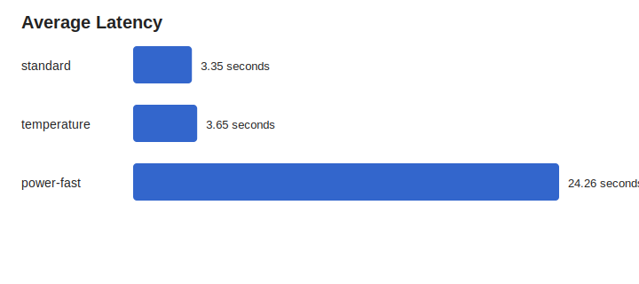
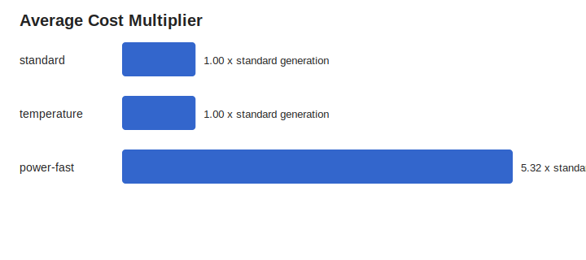
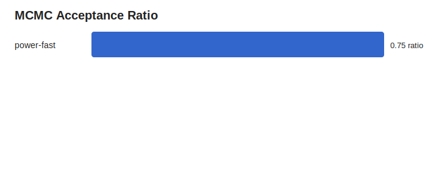
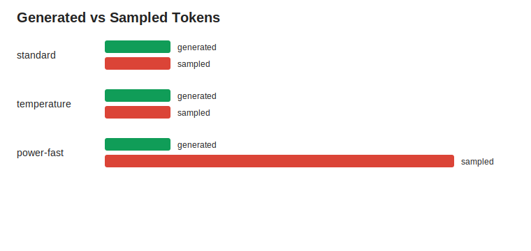

# GSM8K Mini Clean3 Qwen3 0.6B MLX T128

This folder contains a tracked LocalBooster experiment.

## Scope

- backend: `mlx`
- model: `mlx-community/Qwen3-0.6B-4bit`
- records: `9` JSONL rows
- purpose: quality, runtime, and cost benchmark
- note: runs used short 128-token completions, so answers may be incomplete

## Summary

| Sampler | Runs | Accuracy | Avg Latency | Avg Cost x | Avg Acceptance | Avg Generated | Avg Sampled |
| --- | ---: | ---: | ---: | ---: | ---: | ---: | ---: |
| `standard` | 3 | 0.00 | 3.35s | 1.00 | n/a | 128.0 | 128.0 |
| `temperature` | 3 | 0.00 | 3.65s | 1.00 | n/a | 128.0 | 128.0 |
| `power-fast` | 3 | 0.00 | 24.26s | 5.32 | 0.75 | 128.0 | 680.7 |

## Files

- `data/results.jsonl`: raw LocalBooster output rows
- `data/summary.csv`: tabular aggregate metrics
- `data/summary.json`: aggregate metrics as JSON
- `plots/latency_seconds.svg`: average latency by sampler
- `plots/cost_multiplier.svg`: average sampled-token cost multiplier
- `plots/acceptance_ratio.svg`: MCMC acceptance ratio where applicable
- `plots/accuracy.svg`: benchmark accuracy, when scored answers are present
- `plots/tokens.svg`: generated vs sampled token counts

## Charts

