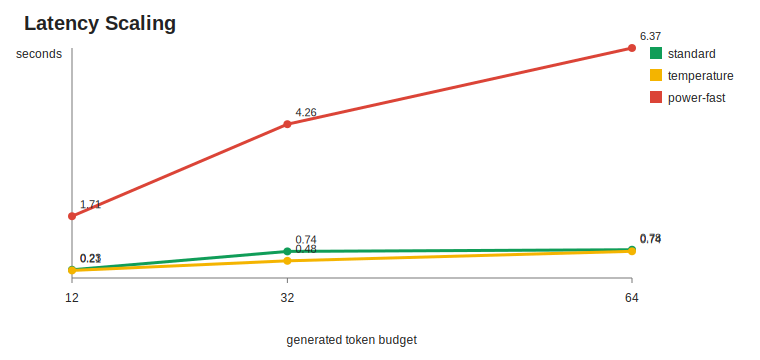
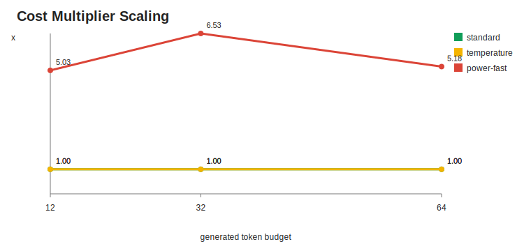
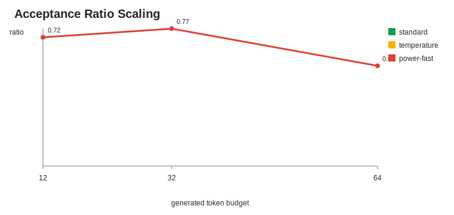

# Qwen3 0.6B MLX Smoke Scaling

This folder compares the tracked smoke runs at 12, 32, and 64 generated tokens.

These are runtime/cost smoke tests, not accuracy benchmarks.

## Summary

| Tokens | Sampler | Runs | Avg Latency | Avg Cost x | Avg Acceptance |
| ---: | --- | ---: | ---: | ---: | ---: |
| 12 | `standard` | 3 | 0.23s | 1.00 | n/a |
| 12 | `temperature` | 3 | 0.21s | 1.00 | n/a |
| 12 | `power-fast` | 3 | 1.71s | 5.03 | 0.72 |
| 32 | `standard` | 3 | 0.74s | 1.00 | n/a |
| 32 | `temperature` | 3 | 0.48s | 1.00 | n/a |
| 32 | `power-fast` | 3 | 4.26s | 6.53 | 0.77 |
| 64 | `standard` | 3 | 0.78s | 1.00 | n/a |
| 64 | `temperature` | 3 | 0.74s | 1.00 | n/a |
| 64 | `power-fast` | 3 | 6.37s | 5.18 | 0.56 |

## Charts

