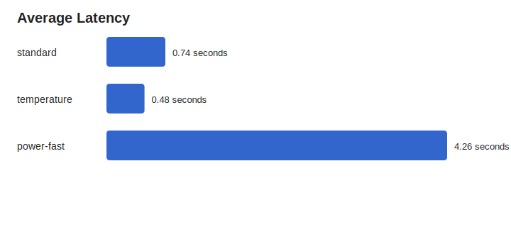
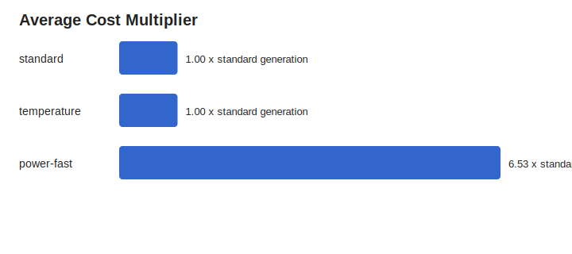
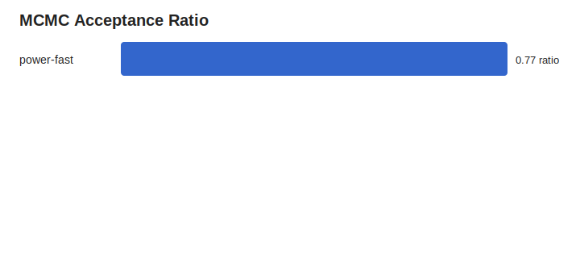
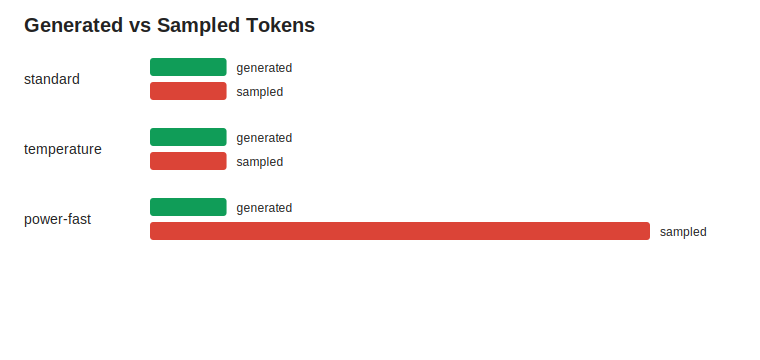

# Qwen3 0.6B MLX Smoke Experiment T32

This folder contains a tracked LocalBooster smoke experiment.

## Scope

- backend: `mlx`
- model: `mlx-community/Qwen3-0.6B-4bit`
- records: `9` JSONL rows
- purpose: runtime and cost smoke test, not an accuracy benchmark
- note: runs used short 32-token completions, so answers may be incomplete

## Summary

| Sampler | Runs | Avg Latency | Avg Cost x | Avg Acceptance | Avg Generated | Avg Sampled |
| --- | ---: | ---: | ---: | ---: | ---: | ---: |
| `standard` | 3 | 0.74s | 1.00 | n/a | 32.0 | 32.0 |
| `temperature` | 3 | 0.48s | 1.00 | n/a | 32.0 | 32.0 |
| `power-fast` | 3 | 4.26s | 6.53 | 0.77 | 32.0 | 209.0 |

## Files

- `data/results.jsonl`: raw LocalBooster output rows
- `data/summary.csv`: tabular aggregate metrics
- `data/summary.json`: aggregate metrics as JSON
- `plots/latency_seconds.svg`: average latency by sampler
- `plots/cost_multiplier.svg`: average sampled-token cost multiplier
- `plots/acceptance_ratio.svg`: MCMC acceptance ratio where applicable
- `plots/tokens.svg`: generated vs sampled token counts

## Charts

